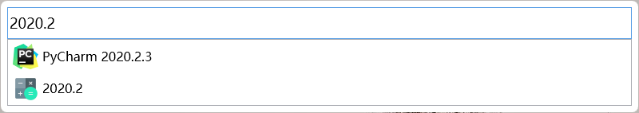
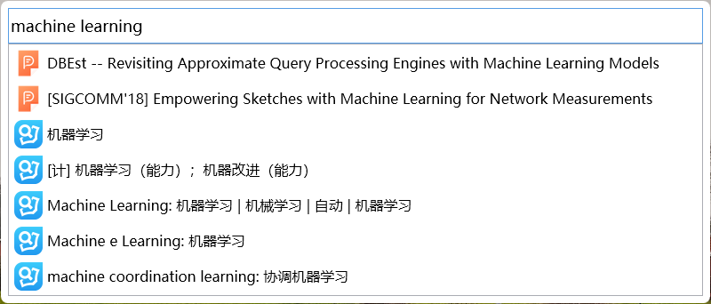
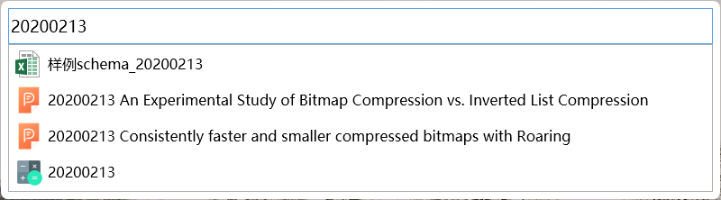

# Toys V2.0

Translator / Calculator / Launcher / File Searcher

## Download
[https://github.com/skyduy/toys/releases](https://github.com/skyduy/toys/releases)

## Usage
`Alt+Space`

## Demonstrate

## TODOs
- [x] 依赖：摆脱对 Windows Index 的依赖
- [x] 后台异步实时更新索引
- [x] User privacy：不显示用户设置为隐藏属性的文件（可选）
- [x] 设置保存后，不用重启程序
- [x] ListBox Item 响应双击打开
- [x] ListBox Item 不同结果响应右键菜单，不同结果响应不同菜单
- [x] ListBox Item 结果美化
- [ ] 添加 Log 日志文件
- [x] ListBox Item 记录最近最常使用
- [x] ListBox Item 加载项限制
- [ ] UWP Apps 搜索支持
- [x] 搜索功能，针对文件夹增强（文件夹变化，文件夹属性变化，支持文件夹搜索）
- [x] 搜索框换行转换
- [x] 配置文件增加出现项
